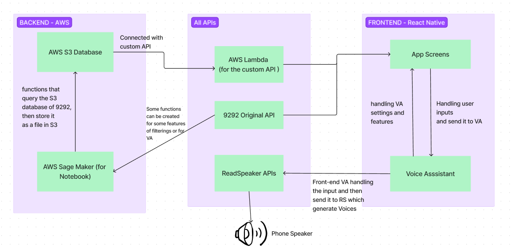

# 9292Hoi - A Gamified Voice-based Travel Companion

## Introduction
This is a project design for the 9292 AI Challenge. The idea of this project is to bring a new feature to the 9292 app, which is a voice-based travel companion. The user can ask the voice assistant about the public transport in the Netherlands, about the travel information during their trips and the assistant will provide you with details information. The app can also give the user advice about the best route to take to get to a certain destination, some updates about delay or stops and some recommendations for local places. The app is also gamified, which means that the user can earn coins through their travel, which can help user engaging in their travel experience. The user can also use the coins to buy the customizations for their travel companion (the voice).

## Our Teams:
We called ourself `RUG-UT-RS`, we are a diverse group of students from the University of Gronigen, University of Twente and ReadSpeaker. The team members are:
  //TODO: Add team members
  - [Phuoc Ho](https://github.com/hhoangphuoc?tab=repositories)
  - [Aki Kunikoshi](https://github.com/yemaozi88?tab=repositories)
  - Yanpei Ouyang
  - Xueying Liu
  - [Brandi Hongell](https://github.com/branaphy?tab=repositories)
  - Chenyi
  - Yilan Wei
---

# 1st Prototype Development
### Description
For the first prototype, we will not making the framework to fully-connected with AWS environment, instead, the goal of this prototype is to establishing the connection between the database and the UI, also making sure the voice assistant can giving the right travel information in different circumstance. Hence, the following features will be implemented:
#### Data
- The data will only contain the information of `1 specific user` and `1 specific route`. This data will be extracted as a smaller dataset getting from the 9292 data in AWS S3. The data will be stored in `.csv` format and store in other database without connecting to AWS cloud
  - *For example:* User: `user 1`, Route: `Utrecht -> Den Haag -> Delft` 
- Create different JSON files for information that can be extracted, for example: `location.json` for storing location data in details, `route.json` for details and all possibilies of travel routes available from different locations, `travel.json` for storing travel information.
- **NOTES: ** Person in charge: (Xueying, Brandi) - will discuss on details about how to get, store and extract the data from AWS S3 and Redshift
#### Voice Assistant
- For the simplicity, the initial step is to think of the structure and content of the information that can be given as an output of the Voice Assistant.
  - *For example:* What the information of the route will be given? What the information of the location will be given?
- Further steps is to use `ReadSpeaker API` to generate the voice from the text, the voice will be generated in `.wav` format and will be played through the phone speakers

#### Gamification
- Determine the coins system, how the user can earn coins, how the user can spend coins
- Defined different options and scenarios depends on transportation, location, time, ...

#### UI
- Create the UI for the app
- Handle user input and perform the correct data corresponding to the user input.
- Connect with speaker, so that the voice assistant can speak out the information

#### API
- Make use of `9292 API`, but this is not the top priority
- In case the JSON file not working well, create a simple custom API for connecting the backend and the frontend, this API will be used for handling user input and request from the app

### TASK LIST:
Based on the description, here are the main tasks list that need to be done:
#### Task 1: Data (Xueying-@xuliu15 and Brandi-@branaphy)
- [ ] Determine which `user` can be used, which `route` should be used which can ensure different options of traveling
- [ ] List all the possible travel routes that can be used for the prototype
- [ ] Extracting data from AWS S3
- [ ] Creating the database for storing the data
- [ ] Determining the ***structure and the format of the data*** and how the data are linked and connected (for example: route contains which information, location contains which information, how they are connected,... )
- [ ] Creating the JSON files from the query data so that it can be handled in Frontend

#### Task 2: Gamification-Coins System (Yangpei-@IamPage)
- [ ] Think about the coins system, how the user can earn coins, how the user can spend coins
- [ ] Defined different options depends on transportation, location, time, ....
- [ ] How much coins the user can earn for each trip/route, how much coins the user can spend for each customization

#### Task 3 (Chenyi-@Chenyi063 and Yilan-@weiyilan9 + Aki-@yemaozi88 as supervised)
- [ ] Think about what kind of audio should be used to explain the path, provide the useful information (which door will open, almost arrive ... ) 
- [ ] Think about the content of the information in details, for specific cases. 
- [ ] Later step:connecting the text to `ReadSpeaker API` he audio will be generated from the text using ReadSpeaker API, the audio will be played through the phone speakers

#### Task 4 (Phuoc Ho - @hhoangphuoc)
- [ ] Create the UI for the app, including the main screen, the screen for the travel information, the screen for the customization, the screen for the coins system
- [ ] Connecting the user input to the corresponding audio output (might be connect `ReadSpeaker API`, if  possible)
- [ ] Connecting the user input to the corresponding travel information (might be connect directly to `9292 API`, if possible)

#### Task 5 (All)
- [ ] Schedule a weekly meeting to discuss about the progress, the problems, the solutions
- [ ] Keep track of the work flow, make sure the communication between different parts are working well
- [ ] Keep track of the progress, make sure the project is on track

---
---
## Product Development (Further Development)
### System Design

### Implementation
#### Backend:
For the backend, using the resources provided by AWS environment of 9292 maily for the following tasks:
  - Analyse the data, through query by connecting with **S3 database**, using [AWS S3](https://s3.console.aws.amazon.com/s3/buckets/aiwedstrijd-team1?region=eu-central-1&tab=objects) to store the database, the data will be store in `.csv` format. In details:
    - Go to [AWS SageMaker -> Notebook -> Notebook Instances -> aiwedstijd-sagemaker-team1](https://eu-central-1.console.aws.amazon.com/sagemaker/home?region=eu-central-1#/notebook-instances/aiwedstijd-sagemaker-team1) to go to Jupyter Notebook environment
    - Working with Python to create the function to querying and merging the data, The following features/functions can be implemented:
        - A function that collects details about trasportations, travel companies and services: **Input:** 9292 Database/API -> **Output:** A `.csv` file store in S3
        - A function that collects all the locations (including names, places, coordinates)
- Working with 9292 API:
        - Link to the API: [9292 Original API](https://reisadvies-api-ast.9292.nl/v4)
        - Link to Documentation about the API [9292 API Documentation](https://reisadvies-api-ast.9292.nl/index.html) - Use this to see the endpoint call to get 9292 Data
      ***Notes***: remember to use the given token as an request *Header* and setting the parameters when sending a GET request

#### API - Connection between frontend and backend: 
Create a custom API so that it can be communicated with the backend
- Using [AWS Lambda](https://eu-central-1.console.aws.amazon.com/lambda/home?region=eu-central-1#/functions) to create the API that connect with AWS S3. This API will be used as a connection to the Frontend so that it can handling user input/request from the app
  - For example: Voice requests,...
- Using **`9292 Travel API`** for general travelling usage, this can also be connected with the S3 for different purposes
- Using **`ReadSpeakers API`** for generating voice from Voice Assistant text generation

#### Front-end
- Using React Native for UI, and handling user inputs
- Connect with `custom API` and `9292 API` for providing travel information
- Connect with `ReadSpeakers API` for providing voice feedbacks to phone speakers
